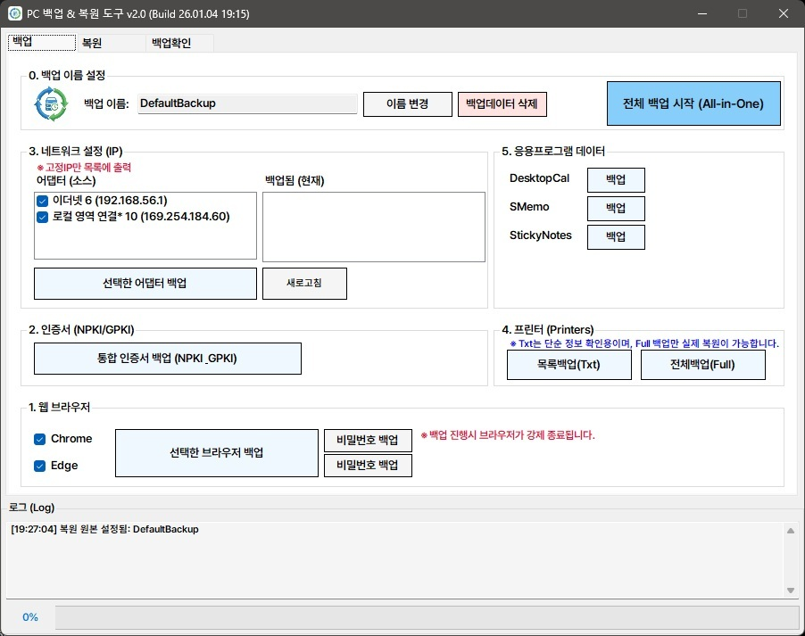
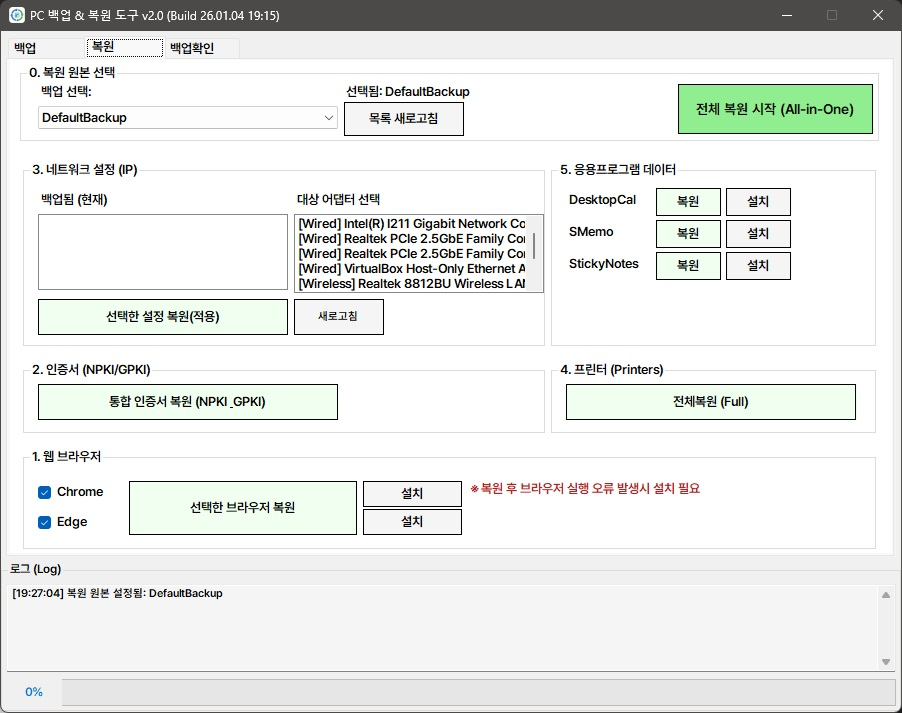
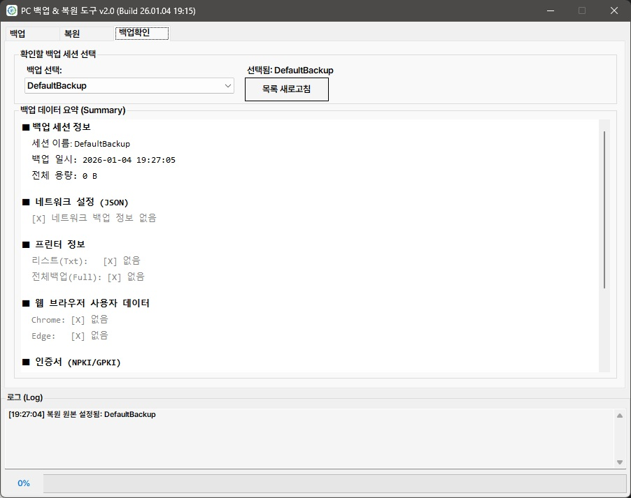

# 백업 및 복원 도구 (Backup & Restore Tool) 기능 명세서

이 문서는 프로그램에 구현된 **모든 기능과 상세 로직, 데이터 경로**를 제3자가 완벽하게 재구현할 수 있도록 상세히 기술합니다.

## 0. 초기화 및 기본 설정 (Initialization)
프로그램 시작 시 수행되는 기본 로직 및 폴더 관리 정책입니다.

*   **백업 폴더 관리 (Session Management) - [필수]**:
    *   **데이터 혼용 방지**: 여러 백업 데이터가 `Backup` 폴더 하나에 뒤섞이는 것을 방지하기 위해, **하위 폴더(Subfolder)** 단위로 관리합니다.
    *   **시작 시 팝업**: 프로그램 실행 최초 1회, **"백업 데이터를 저장할 폴더 이름을 입력하세요"** 라는 팝업(Input Dialog)을 띄웁니다.
    *   **경로 설정**: 입력받은 이름을 기반으로 작업 경로를 설정합니다. (`[실행경로]\Backup\[입력한 폴더명]`)
*   **백업 데이터 관리 (선택/삭제 기능) - [필수]**:
    *   **폴더 변경**: UI 상단에서 작업 폴더를 실시간으로 변경하거나 새로 생성할 수 있어야 합니다.
    *   **데이터 유효성 검사**: 선택된 폴더 내 데이터 존재 여부를 확인하여 복원 버튼 활성화/비활성화 상태를 제어합니다.
    *   **삭제 기능 (Data Deletion)**:
        *   **개별 삭제**: 각 항목(브라우저, 네트워크, 프린터 등)별로 백업된 데이터만 선택적으로 삭제하는 버튼이나 컨텍스트 메뉴를 제공해야 합니다.
        *   **전체 삭제**: 현재 선택된 백업 세션 폴더(`[입력한 폴더명]`) 자체를 통째로 삭제하는 기능을 제공해야 합니다. (삭제 전 "정말 삭제하시겠습니까?" 경고 팝업 필수)

## 1. 웹 브라우저 백업 및 복원
**지원 브라우저**: Google Chrome, Microsoft Edge

*   **UI 구성 요구사항**:
    *   **설치 버튼 (필수)**: 각 브라우저 항목 옆에 '설치' 버튼 배치 (복원 후 실행 오류 대비).
    *   **데이터 유무 표시**: 선택된 백업 폴더 안에 `Chrome` 또는 `Edge` 폴더가 있는지 확인하여 UI에 표시.
*   **일괄/개별 처리**: '전체 백업/복원' 및 체크박스를 통한 '개별 선택' 지원.
*   **백업/복원 로직**:
    *   **프로세스 강제 종료**: `chrome.exe`, `msedge.exe` 종료 후 작업.
    *   **데이터 복사**: 사용자 데이터 폴더 전체 복사.
*   **저장된 비밀번호 관리 (자동화 지원)**:
    - **자동 이동 로직**: 버튼 클릭 시 브라우저 실행 후 설정 페이지로 자동 이동.
    - **상세 단계**: 주소 복사(Clipboard) -> 브라우저 실행 -> 창 감지(Polling) -> 윈도우 포커스(SetForegroundWindow) -> 주소창 이동(Alt+D) -> 붙여넣기(Ctrl+V) -> 이동(Enter).
    - **안전장치**: STA 스레드 사용으로 런타임 오류 방지 및 최대 10초간 창 감지 타임아웃 적용.
*   **상세 경로**:
    | 브라우저 | 원본 경로 (Source) | 백업 경로 (Destination) |
    | :--- | :--- | :--- |
    | **Chrome** | `%UserProfile%\AppData\Local\Google\Chrome\User Data` | `[선택한 백업 폴더]\Chrome` |
    | **Edge** | `%UserProfile%\AppData\Local\Microsoft\Edge\User Data` | `[선택한 백업 폴더]\Edge` |

## 2. 인증서 백업 및 복원
PC에 저장된 공동인증서(NPKI)와 행정전자서명 인증서(GPKI)를 백업합니다.

*   **데이터 유무 표시**: 백업 폴더 내 `Certificates\NPKI` 또는 `Certificates\GPKI` 존재 여부 확인.
*   **상세 경로**:
    | 구분 | 원본 경로 (Source) | 백업 경로 (Destination) |
    | :--- | :--- | :--- |
    | **NPKI** (은행/범용) | `%UserProfile%\AppData\LocalLow\NPKI` | `[선택한 백업 폴더]\Certificates\NPKI` |
    | **GPKI** (행정용) | `C:\GPKI` | `[선택한 백업 폴더]\Certificates\GPKI` |

## 3. 네트워크 (IP) 설정 백업 및 복원
PC의 네트워크 어댑터 설정을 관리합니다.

*   **데이터 유무 표시**: `NetworkConfig.json` 파일 존재 여부를 확인하고, 파일이 있어야 '복원 목록'을 로드함.
*   **UI 구성 (3단 리스트)**:
    1.  **좌측 (소스)**: 현재 활성 어댑터 목록.
    2.  **중앙 (백업 데이터)**: JSON 파일에서 로드한 백업 설정 목록. (파일 없으면 비활성)
    3.  **우측 (타겟)**: 복원 대상 어댑터 목록.
*   **백업/복원 로직**: JSON 및 TXT 포맷으로 저장하며, `netsh` 명령을 통해 1:N 강제 복원을 수행합니다.
*   **상세 경로**:
    *   `[선택한 백업 폴더]\NetworkConfig.json`
    *   `[선택한 백업 폴더]\NetworkConfig.txt`

## 4. 프린터 백업 및 복원
두 가지 모드를 지원합니다.

*   **데이터 유무 표시**: `프린터정보.txt` 및 `PrinterFullBackup.printerExport` 파일 존재 확인.

### A. 선택한 프린터 정보 저장 (단순 텍스트)
*   **기능**: 목록에서 선택한 프린터 정보만 텍스트로 저장.
*   **경로**: `[선택한 백업 폴더]\프린터정보.txt`

### B. 프린터 전체 시스템 백업 (Full Backup)
*   **기능**: `PrintBrm.exe`를 이용한 시스템 전체 백업.
*   **경로**: `[선택한 백업 폴더]\PrinterFullBackup.printerExport`

## 5. 메모 및 캘린더 프로그램 백업 및 복원
유틸리티 프로그램의 데이터를 백업합니다.

*   **데이터 유무 표시**: `DesktopCal`, `SMemo`, `StickyNotes` 각 폴더 존재 여부 확인.
*   **백업/복원 로직**: 프로세스 강제 종료 후 폴더 복사.
*   **상세 경로**:
    | 프로그램 | 원본 경로 (Source) | 백업 경로 (Destination) |
    | :--- | :--- | :--- |
    | **DesktopCal** | `%AppData%\DesktopCal` | `[선택한 백업 폴더]\DesktopCal` |
    | **SMemo** | `C:\SMYSoft` (or `%AppData%`) | `[선택한 백업 폴더]\SMemo` |
    | **Sticky Notes** | `%LocalAppData%\Packages\...\LocalState` | `[선택한 백업 폴더]\StickyNotes` |

## 6. 프로그램 설치 지원 (Installer)
실행 파일 주변의 `install` 폴더를 탐색합니다.

*   **탐색 로직**: `install` 폴더가 실제로 존재하는지, 안에 파일이 있는지 확인하여 UI 버튼 활성화/비활성화.
*   **지원 파일 패턴**: `Chrome*.exe`, `Edge*.exe`, `DesktopCal*.exe`, `SMemo*.exe`, `StickyNotes.bat`

## 7. 공통 시스템 기능
*   **로그 시스템**: 타임스탬프 포함 실시간 로그.
*   **진행률(Progress) 시스템**: 비동기 작업 진행률 표시.
*   **권한 상승**: 관리자 권한(`requireAdministrator`) 필수.
*   **UI 잠금 시스템 (Turbo Lock)**: 
    - **전역 차단**: 백업/복원 작업 중 중앙 패널(`pnlMiddle`)과 모든 액션 버튼을 비활성화하여 중복 실행 및 충돌 방지.
    - **시각적 알림**: 작업 중 메인 버튼 색상 변경(주황색/진한 회색) 및 마우스 커서 대기 상태 변경.
    - **동기화**: 비밀번호 자동화와 같은 외부 프로세스 연동 작업 시에도 작업 완료까지 UI 잠금 유지.

## 8. 백업 검증 (Backup Verification)
백업된 데이터의 상태를 시각적으로 확인합니다.

*   **색상 코드 시스템**:
    - **SeaGreen (굵게)**: 데이터가 존재함 (`[V] 존재`)
    - **Gray**: 데이터가 없음 (`[X] 없음`)
*   **세션 자동 선택**: 검증 탭 진입 시 최근 백업 세션 자동 로드.

## 9. 주요 사용자 안내 및 주의/경고 메시지
1.  **초기 폴더 명명 안내 (필수)**
    *   상황: 프로그램 최초 실행 시.
    *   메시지: `"백업 데이터를 저장할 폴더 이름을 입력하세요. (기존 폴더가 있다면 이름을 동일하게 입력)"`
2.  **브라우저 복원 후 오류 대응**
    *   메시지: `"복원 후 브라우저 실행 오류가 발생하면 설치 버튼을 눌러 재설치 하세요."`
3.  **데이터 삭제 경고**
    *   상황: 백업 데이터 삭제 버튼 클릭 시.
    *   메시지: `"선택한 백업 데이터를 정말 삭제하시겠습니까? (복구 불가)"`
4.  **브라우저 전체 복원 (데이터 소실)**
    *   메시지: `"브라우저 및 인증서 복원을 진행하시겠습니까?\n(기존 데이터는 덮어씌워집니다)"`
    *   메시지: `"선택한 폴더에 백업 데이터가 없습니다."`

## 10. 프로그램 구동 화면 (Screenshots)

*기본 백업 설정 및 통합 백업 인터페이스*

*백업 데이터 선택 및 복원 인터페이스*

*백업 데이터 존재 여부 시각적 색상 코드 확인*
